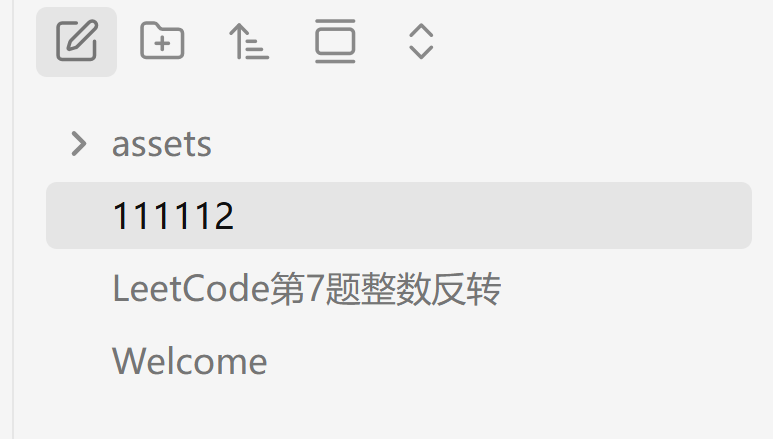

# 1111
## 222
3333
44444
>[!quote]
>这是一个info类型的callout

**5555566666**
- 7777788888


```cardlink
url: http://xhslink.com/o/5wl050hYj75
title: "字节跳动生活服务后端日常实习一面 - 小红书"
description: " 总时长1h20min 1. 自我介绍 2. 拷打项目➕八股，30min 3. 手撕2道，45min #找实习 #java #字节跳动"
host: xhslink.com
```
 
```cardlink
url: https://www.xiaohongshu.com/discovery/item/692007f6000000001e00352b?source=webshare&xhsshare=pc_web&xsec_token=AB7G_jXKN95TPkyy6Zi7KwTnDVvU_P2lw7FUwqgo5_7wY=&xsec_source=pc_share
title: "中台｜不敢想自己在字节的面评有多脏 - 小红书"
description: " 第二次面字节了 又是中台字节的面试非常经典的环节就是有智力题 我遇到的面试官都特别喜欢用高高在上的姿态看待我这种笨人 真没救了 	 自我介绍完先手撕，接雨水 很经典的字节题 介绍一下暑期实习 然后问我为什么会投后端情商题（山东人来答） 	 狠狠拷打了线程池相关的：Java里面创建线程的方法 线程池有哪些核心参数，以及内部的运行机制？如果让你现在设计一个线程池你从那些方便来考虑？ Java里面控制线程同步的方式有了解过吗 volatile和synchronized关键字🆚 一个场景题：假设有一个 Java 类，我们称它为 类 Z。 这个类中有两个实例方法：方法 A 和 方法 B。 这两个方法的签名上都使用了 synchronized 关键字修饰。 现在，我们执行以下步骤： 1. 初始化：创建类 Z 的一个对象（即单个实例）。 2. 并发调用：创建两个线程，让它们同时运行： · 线程 1 调用这个对象的 方法 A · 线程 2 调用这个对象的 方法 B 核心问题： 这两个被不同线程调用的方法（A 和 B），能否同时执行？答案是不能 刚刚说到了线程池里提到了ThreadLoacal了解过吗内部原理 key和value 分别是什么 JVM的内存划分以及垃圾回收机制 Spring经常用的注解有哪些 Spring事务传播机制 MySQL的InnoDB有哪些事务隔离级别 表的设计题 题都没听懂看我答不出来继续问八股MySQL索引失效有哪些情况？ 问我有什么比较擅长的科目吗 计网还是操作系统送命题谁敢答 然后问我知道grpc吗问我为什么有了http还需要rpc呢 #后端开发 #java #秋招 #计算机 #实习 #找工作"
host: www.xiaohongshu.com
```
[中台｜不敢想自己在字节的面评有多脏 - 小红书](https://www.xiaohongshu.com/discovery/item/692007f6000000001e00352b?source=webshare&xhsshare=pc_web&xsec_token=AB7G_jXKN95TPkyy6Zi7KwTnDVvU_P2lw7FUwqgo5_7wY=&xsec_source=pc_share)

> [!multi-column]
>
>> [!note]+ Work
>> your notes or lists here. using markdown formatting
>
>> [!warning]+ Personal
>> your notes or lists here. using markdown formatting
>
>> [!summary]+ Charity
>> your notes or lists here. using markdown formatting

> [!multi-column]
>
>> [!note|wide-3]+ Work
>> your notes or lists here. using markdown formatting
>
>> [!warning|wide-2]+ Personal
>> your notes or lists here. using markdown formatting
>
>> [!summary|min-0]+ Charity
>> your notes or lists here. using markdown formatting
